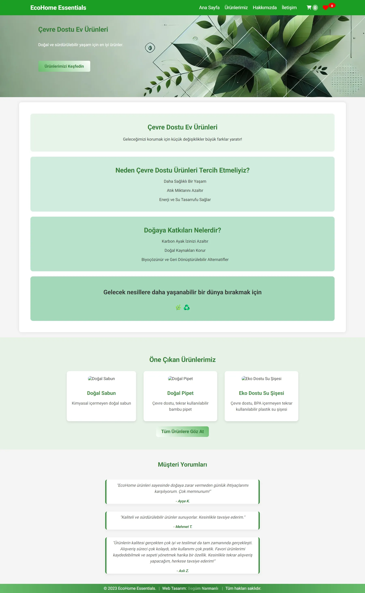
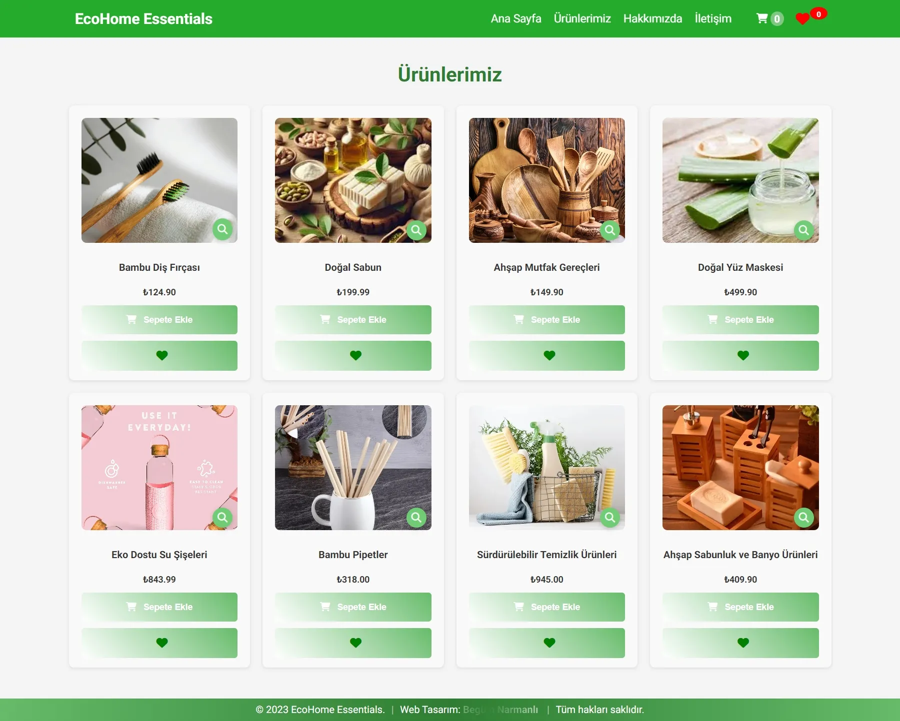

# 🌱 Eco Home Essentials

Eco Home Essentials, sürdürülebilir ve doğa dostu ev ürünlerinin sergilendiği modern bir e-ticaret arayüzü projesidir. Bu proje, hem çevre bilincini artırmayı hem de kullanıcı dostu bir alışveriş deneyimi sunmayı hedefler.

> **Not:** Bu projede kullanılan fiyatlar ve ürün açıklamaları gerçek değerleri yansıtmamaktadır; proje sergileme ve geliştirme amaçlı "mock data" (temsili veri) kullanılarak hazırlanmıştır.

## 🚀 Proje Özellikleri

- **Modern & Responsive Tasarım:** Tüm cihazlarda (Mobil, Tablet, Masaüstü) kusursuz görünüm.
- **Dinamik İçerik Yönetimi:** JavaScript ile yönetilen sepet sistemi ve ürün etkileşimleri.
- **Performans Odaklı:** Tüm görseller **WebP** formatına dönüştürülerek sayfa yükleme hızları optimize edildi.
- **SEO Dostu:** Anlamlı HTML etiketleri (Semantic HTML) ile yapılandırıldı.

## 🛠️ Kullanılan Teknolojiler

- **HTML5:** Yapısal düzen ve semantik etiketleme.
- **CSS3:** Custom Animations, Shimmer Effect, Flexbox ve Grid sistemleri.
- **JavaScript (ES6+):** Sepet mantığı, favori listesi yönetimi ve DOM manipülasyonu.
- **WebP Image Optimization:** Yüksek performanslı görsel yönetimi.

## 📸 Ekran Görüntüleri

  
  &nbsp;&nbsp;
  

  <i>Projenin masaüstü ve ürün listeleme arayüzleri yan yana gösterilmiştir.</i>

## 📊 Lighthouse Performans Skorları

### 🖥️ Masaüstü

  

### 📱 Mobil

  

## 👤 Geliştirici

**Begüm Narmanlı**

- GitHub: [@begumnarmanli](https://github.com/begumnarmanli)
- LinkedIn: [Begüm Narmanlı](https://www.linkedin.com/in/begumnarmanli/)

&nbsp;

---

&nbsp;

# 🌱 Eco Home Essentials

Eco Home Essentials is a modern e-commerce interface project showcasing sustainable and eco-friendly home products. This project aims to raise environmental awareness while providing a user-friendly shopping experience.

> **Note:** The prices and product descriptions used in this project do not reflect real values; the project was prepared using "mock data" for demonstration and development purposes.

## 🚀 Project Features

- **Modern & Responsive Design:** Flawless appearance on all devices (Mobile, Tablet, Desktop).
- **Dynamic Content Management:** Cart system and product interactions managed with JavaScript.
- **Performance Focused:** All images converted to **WebP** format to optimize page load times.
- **SEO Friendly:** Structured with meaningful HTML tags (Semantic HTML).

## 🛠️ Technologies Used

- **HTML5:** Structural layout and semantic markup.
- **CSS3:** Custom Animations, Shimmer Effect, Flexbox and Grid systems.
- **JavaScript (ES6+):** Cart logic, favorites list management and DOM manipulation.
- **WebP Image Optimization:** High-performance image management.

## 📸 Screenshots

  
  &nbsp;&nbsp;
  

  <i>Desktop and product listing interfaces shown side by side.</i>

## 📊 Lighthouse Performance Scores

### 🖥️ Desktop

  

### 📱 Mobile

  

## 👤 Developer

**Begüm Narmanlı**

- GitHub: [@begumnarmanli](https://github.com/begumnarmanli)
- LinkedIn: [Begüm Narmanlı](https://www.linkedin.com/in/begumnarmanli/)